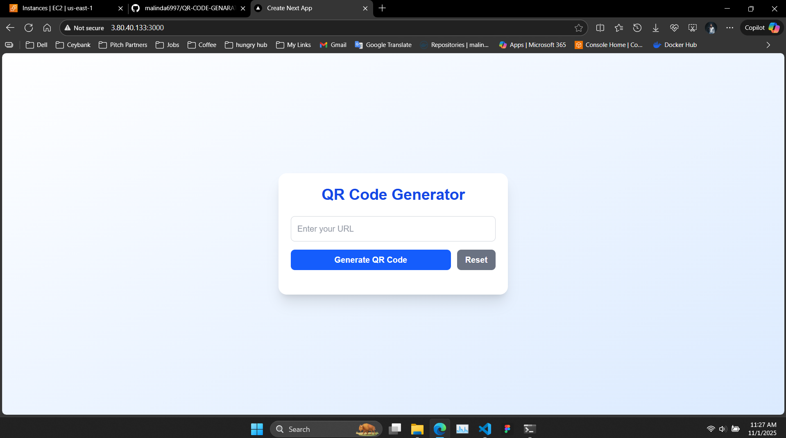
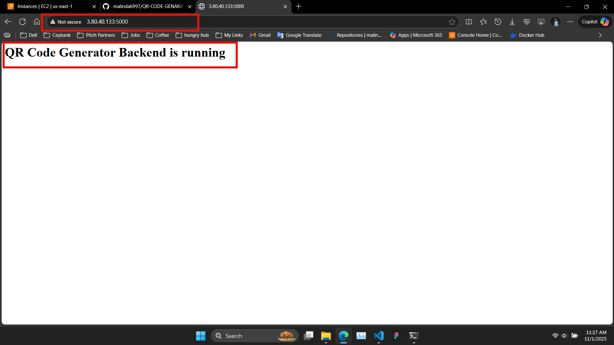
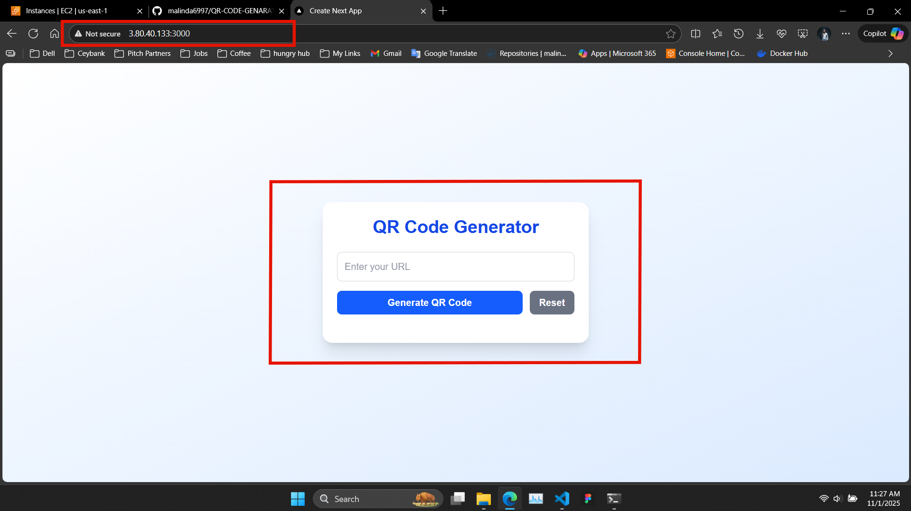
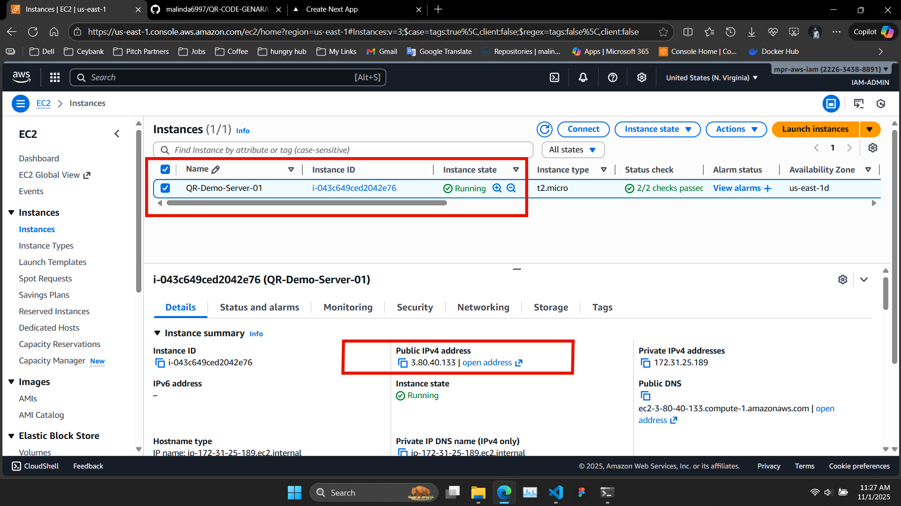
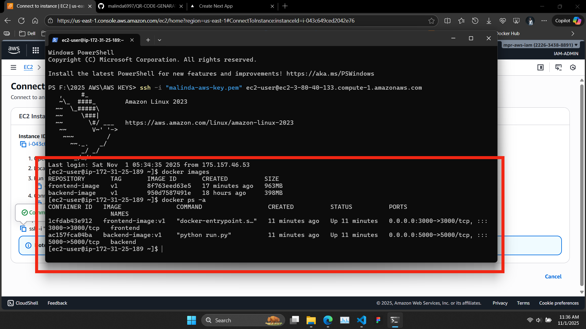

# 🔲 QR Code Generator Application

A modern, full-stack QR Code Generator application built with **Next.js** (Frontend) and **Flask** (Backend), containerized with Docker and automated with Jenkins CI/CD pipeline.



## 📋 Table of Contents

- [Features](#features)
- [Tech Stack](#tech-stack)
- [Architecture](#architecture)
- [Prerequisites](#prerequisites)
- [Installation](#installation)
- [Usage](#usage)
- [AWS EC2 Deployment](#️-aws-ec2-deployment)
- [Docker Deployment](#docker-deployment)
- [API Documentation](#api-documentation)
- [Screenshots](#screenshots)
- [Project Structure](#project-structure)
- [Contributing](#contributing)
- [License](#license)

## ✨ Features

- 🎨 **Modern UI/UX** - Clean and responsive interface built with Next.js 15 and Tailwind CSS
- ⚡ **Real-time Generation** - Instant QR code generation with live preview
- 📥 **Download Support** - Download generated QR codes as PNG images
- 🐳 **Dockerized** - Fully containerized application for easy deployment
- **Production Ready** - Optimized for performance and scalability
- 🔌 **RESTful API** - Clean and simple API endpoints

## 🛠 Tech Stack

### Frontend

- **Next.js 15** - React framework with App Router
- **React 19** - Latest React with modern features
- **TypeScript** - Type-safe development
- **Tailwind CSS 4** - Utility-first CSS framework
- **Axios** - HTTP client for API requests
- **Docker** - Containerization

### Backend

- **Flask 3.1** - Python web framework
- **Flask-CORS** - Cross-Origin Resource Sharing
- **qrcode[pil] 8.0** - QR code generation library
- **Pillow** - Image processing
- **Docker** - Containerization

### DevOps

- **Docker & Docker Compose** - Container orchestration
- **Git/GitHub** - Version control

## 🏗 Architecture

```
┌─────────────────┐         ┌─────────────────┐
│   Next.js       │         │   Flask API     │
│   Frontend      │ ◄────►  │   Backend       │
│   (Port 3000)   │  HTTP   │   (Port 5000)   │
└─────────────────┘         └─────────────────┘
        │                           │
        └───────────┬───────────────┘
                    │
            ┌───────▼────────┐
            │  Docker        │
            │  Compose       │
            └────────────────┘
```

## 📦 Prerequisites

Before you begin, ensure you have the following installed:

- **Node.js** (v20 or higher)
- **Python** (v3.10 or higher)
- **Docker** (v24.0 or higher)
- **Docker Compose** (v2.20 or higher)
- **Git**

## 🚀 Installation

### 1. Clone the Repository

```bash
git clone https://github.com/malinda6997/QR-CODE-GENARATE-APPLICATION-Next-Js-Python-flask-.git
cd QR-CODE-GENARATE-APPLICATION-Next-Js-Python-flask-
```

### 2. Backend Setup

```bash
# Navigate to backend directory
cd backend

# Create virtual environment
python -m venv venv

# Activate virtual environment
# On Windows:
venv\Scripts\activate
# On Mac/Linux:
source venv/bin/activate

# Install dependencies
pip install -r requirements.txt

# Run the Flask application
python run.py
```

Backend will be available at: `http://localhost:5000`

### 3. Frontend Setup

```bash
# Navigate to frontend directory
cd frontend

# Install dependencies
npm install

# Run development server
npm run dev
```

Frontend will be available at: `http://localhost:3000`

## 💻 Usage

### Using the Application

1. **Open your browser** and navigate to `http://localhost:3000`
2. **Enter a URL** or text in the input field
3. **Click "Generate QR Code"** to create your QR code
4. **Download** the generated QR code image
5. **Click "Reset"** to clear and start over

### API Endpoints

#### Health Check

```http
GET http://localhost:5000/
```

#### Generate QR Code

```http
POST http://localhost:5000/generate
Content-Type: application/json

{
  "text": "https://example.com"
}
```

Returns a PNG image of the QR code.

## ☁️ AWS EC2 Deployment

### Step-by-Step AWS EC2 Setup

#### 1. Launch EC2 Instance

1. **Login to AWS Console** and navigate to EC2
2. **Launch Instance** with the following specifications:
   - **AMI**: Ubuntu Server 22.04 LTS (or Amazon Linux 2023)
   - **Instance Type**: t2.micro (Free tier) or t2.small
   - **Security Group**: Configure inbound rules:
     ```
     SSH (22)      - Your IP
     HTTP (80)     - 0.0.0.0/0
     HTTPS (443)   - 0.0.0.0/0
     Custom (3000) - 0.0.0.0/0  # Frontend
     Custom (5000) - 0.0.0.0/0  # Backend
     ```
3. **Download Key Pair** (.pem file) and save it securely

#### 2. Connect to EC2 Instance

```bash
# Set proper permissions for your key
chmod 400 your-key.pem

# Connect via SSH
ssh -i "your-key.pem" ubuntu@your-ec2-public-ip
```

#### 3. Install Docker and Docker Compose

```bash
# Update system packages
sudo apt update && sudo apt upgrade -y

# Install Docker
sudo apt install docker.io -y

# Start and enable Docker
sudo systemctl start docker
sudo systemctl enable docker

# Add user to docker group (to run docker without sudo)
sudo usermod -aG docker $USER

# Install Docker Compose
sudo curl -L "https://github.com/docker/compose/releases/latest/download/docker-compose-$(uname -s)-$(uname -m)" -o /usr/local/bin/docker-compose
sudo chmod +x /usr/local/bin/docker-compose

# Verify installations
docker --version
docker-compose --version

# Log out and log back in for group changes to take effect
exit
```

#### 4. Clone the Project

```bash
# Reconnect to EC2
ssh -i "your-key.pem" ubuntu@your-ec2-public-ip

# Install Git (if not already installed)
sudo apt install git -y

# Clone the repository
git clone https://github.com/malinda6997/QR-CODE-GENARATE-APPLICATION-Next-Js-Python-flask-.git

# Navigate to project directory
cd QR-CODE-GENARATE-APPLICATION-Next-Js-Python-flask-
```

#### 5. Update Frontend Configuration

Before building, update the backend API URL in frontend:

```bash
# Edit the frontend page.tsx to use EC2 public IP
nano frontend/src/app/page.tsx
```

Change the API URL from:

```typescript
"http://3.80.40.133/generate";
```

To your EC2 public IP:

```typescript
"http://YOUR-EC2-PUBLIC-IP:5000/generate";
```

#### 6. Build and Run with Docker Compose

```bash
# Build and start all containers
docker-compose up -d --build

# View logs
docker-compose logs -f

# Check running containers
docker ps
```

#### 7. Verify Deployment

```bash
# Check if containers are running
docker ps

# Check Docker images
docker images

# Test backend API
curl http://localhost:5000/

# Test frontend (from your browser)
# Navigate to: http://YOUR-EC2-PUBLIC-IP:3000
```

**Verification Screenshots:**

**Backend Running:**

_Backend API successfully running and responding on port 5000_

**Frontend Running:**

_Frontend application successfully running on port 3000_

**EC2 Server & Public IP:**

_AWS EC2 instance details showing public IP address_

**Docker Containers & Images:**

_Docker containers running and images built successfully (docker ps & docker images)_

#### 8. Configure Firewall (Optional but Recommended)

```bash
# Enable UFW firewall
sudo ufw enable

# Allow SSH
sudo ufw allow 22/tcp

# Allow HTTP/HTTPS
sudo ufw allow 80/tcp
sudo ufw allow 443/tcp

# Allow application ports
sudo ufw allow 3000/tcp
sudo ufw allow 5000/tcp

# Check firewall status
sudo ufw status
```

### Access Your Application

- **Frontend**: `http://YOUR-EC2-PUBLIC-IP:3000`
- **Backend API**: `http://YOUR-EC2-PUBLIC-IP:5000`

### Useful Docker Commands on EC2

```bash
# View running containers
docker ps

# View all containers (including stopped)
docker ps -a

# Stop all containers
docker-compose down

# Restart containers
docker-compose restart

# View logs
docker-compose logs -f

# Rebuild and restart
docker-compose up -d --build

# Remove all containers and images (clean start)
docker-compose down --rmi all
docker system prune -a
```

### Update Application on EC2

When you push changes to GitHub:

```bash
# Connect to EC2
ssh -i "your-key.pem" ubuntu@your-ec2-public-ip

# Navigate to project
cd QR-CODE-GENARATE-APPLICATION-Next-Js-Python-flask-

# Pull latest changes
git pull origin main

# Rebuild and restart containers
docker-compose down
docker-compose up -d --build
```

### Setup Domain Name (Optional)

1. **Get a domain** from providers like Namecheap, GoDaddy, etc.
2. **Configure DNS**:
   - Add an A record pointing to your EC2 public IP
3. **Update Security Groups** to allow traffic
4. **Install Nginx** as reverse proxy:

```bash
sudo apt install nginx -y

# Configure Nginx
sudo nano /etc/nginx/sites-available/qr-app

# Add configuration:
server {
    listen 80;
    server_name your-domain.com;

    location / {
        proxy_pass http://localhost:3000;
        proxy_http_version 1.1;
        proxy_set_header Upgrade $http_upgrade;
        proxy_set_header Connection 'upgrade';
        proxy_set_header Host $host;
        proxy_cache_bypass $http_upgrade;
    }

    location /generate {
        proxy_pass http://localhost:5000;
        proxy_set_header Host $host;
        proxy_set_header X-Real-IP $remote_addr;
    }
}

# Enable site
sudo ln -s /etc/nginx/sites-available/qr-app /etc/nginx/sites-enabled/
sudo nginx -t
sudo systemctl restart nginx
```

### SSL Certificate with Let's Encrypt (Optional)

```bash
# Install Certbot
sudo apt install certbot python3-certbot-nginx -y

# Get SSL certificate
sudo certbot --nginx -d your-domain.com

# Auto-renewal is configured automatically
sudo certbot renew --dry-run
```

## 🐳 Docker Deployment

### Using Docker Compose (Recommended)

The easiest way to run the entire application:

```bash
# Build and start all services
docker-compose up --build

# Run in detached mode
docker-compose up -d --build

# View logs
docker-compose logs -f

# Stop services
docker-compose down
```

### Manual Docker Build

#### Backend Container

```bash
cd backend
docker build -t qr-backend .
docker run -d -p 5000:5000 --name qr-backend qr-backend
```

#### Frontend Container

```bash
cd frontend
docker build -t qr-frontend .
docker run -d -p 3000:3000 --name qr-frontend qr-frontend
```

### Docker Images

- **Backend Image**: `qr-backend`
- **Frontend Image**: `qr-frontend`


## 📸 Screenshots

### AWS EC2 Server & Public IP


_AWS EC2 instance configuration with public IP address_

### Backend API Running


_Flask backend API successfully running on port 5000_

### Frontend Application Running


_Next.js frontend application successfully running on port 3000_

### Docker Containers & Images


_Docker containers and images status (docker ps & docker images commands)_

## 📁 Project Structure

```
QR-CODE-GENARATE-APPLICATION/
│
├── backend/
│   ├── app/
│   │   ├── __init__.py          # Flask app initialization
│   │   └── routes.py            # API routes
│   ├── Dockerfile               # Backend Docker config
│   ├── .dockerignore           # Docker ignore file
│   ├── requirements.txt         # Python dependencies
│   ├── run.py                  # Application entry point
│   └── qr-api-test.postman_collection.json  # API tests
│
├── frontend/
│   ├── src/
│   │   └── app/
│   │       ├── page.tsx        # Main page component
│   │       ├── layout.tsx      # Root layout
│   │       └── globals.css     # Global styles
│   ├── public/                 # Static assets
│   ├── Dockerfile              # Frontend Docker config
│   ├── .dockerignore          # Docker ignore file
│   ├── package.json           # Node dependencies
│   ├── next.config.ts         # Next.js configuration
│   └── tsconfig.json          # TypeScript config
│
├── images/                     # Project screenshots
│   ├── backend.png
│   ├── frontend.png
│   ├── docker.png
│   └── server.png
│
├── docker-compose.yml          # Multi-container setup
└── README.md                   # Project documentation
```

## 🔧 Configuration

### Environment Variables

#### Backend (Optional)

```env
FLASK_ENV=production
FLASK_DEBUG=False
PORT=5000
```

#### Frontend (Optional)

```env
NEXT_PUBLIC_API_URL=http://localhost:5000
```

### Docker Compose Configuration

```yaml
version: "3.9"

services:
  backend:
    build: ./backend
    container_name: qr-backend
    ports:
      - "5000:5000"

  frontend:
    build: ./frontend
    container_name: qr-frontend
    ports:
      - "3000:3000"
    depends_on:
      - backend
```

## 🧪 Testing

### Backend API Tests

```bash
# Using curl
curl -X POST http://localhost:5000/generate \
  -H "Content-Type: application/json" \
  -d '{"text":"https://github.com"}' \
  --output qr.png

# Using Postman
# Import: backend/qr-api-test.postman_collection.json
```

### Frontend Tests

```bash
cd frontend
npm run lint
```

## 🚀 Production Deployment

### Deployment Checklist

- [ ] Update API URL in frontend configuration
- [ ] Set environment variables for production
- [ ] Enable HTTPS/SSL certificates
- [ ] Configure reverse proxy (Nginx/Apache)
- [ ] Set up monitoring and logging
- [ ] Configure firewall rules
- [ ] Enable container restart policies
- [ ] Set up backup and recovery

### Recommended Production Setup

```yaml
# docker-compose.prod.yml
version: "3.9"

services:
  backend:
    build: ./backend
    restart: unless-stopped
    environment:
      - FLASK_ENV=production
    healthcheck:
      test: ["CMD", "curl", "-f", "http://localhost:5000"]
      interval: 30s
      timeout: 10s
      retries: 3

  frontend:
    build: ./frontend
    restart: unless-stopped
    depends_on:
      - backend
```

## 🤝 Contributing

Contributions are welcome! Please follow these steps:

1. Fork the repository
2. Create a new branch (`git checkout -b feature/amazing-feature`)
3. Commit your changes (`git commit -m 'Add some amazing feature'`)
4. Push to the branch (`git push origin feature/amazing-feature`)
5. Open a Pull Request

## 📝 License

This project is open source and available under the [MIT License](LICENSE).

## 👨‍💻 Author

**Malinda**

- GitHub: [@malinda6997](https://github.com/malinda6997)
- Repository: [QR-CODE-GENARATE-APPLICATION-Next-Js-Python-flask-](https://github.com/malinda6997/QR-CODE-GENARATE-APPLICATION-Next-Js-Python-flask-)

## 🙏 Acknowledgments

- Next.js team for the amazing framework
- Flask community for the lightweight backend framework
- Python-qrcode library for QR generation
- Docker for containerization technology

## 📞 Support

If you have any questions or need help, please:

1. Check the [Issues](https://github.com/malinda6997/QR-CODE-GENARATE-APPLICATION-Next-Js-Python-flask-/issues) page
2. Create a new issue with detailed information
3. Contact the maintainer

---

⭐ **If you find this project useful, please give it a star!** ⭐

Made with ❤️ by Malinda
